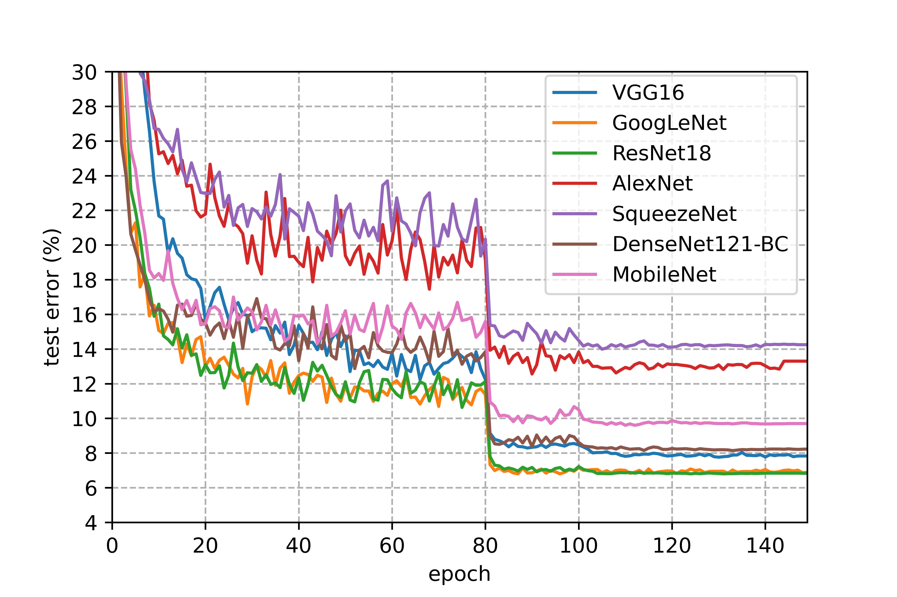

# CIFAR-10 Image Classification

## 1. Introduction

Use Pytorch to replicate some of the image classification models which include AlexNet, SqueezeNet, DenseNet, VGG16, MobileNet, ResNet18 and GoogLeNet.

## 2. Requirements

```
python=3.8.5
pytorch==1.6.0+cu102
torchvision==0.7.0
tensorboard==2.2.1
tensorboardX==2.1
opencv-python
matplotlib
numpy
```

## 3. Configuration

1. Optimizer: SGDm with momentum of 0.9 and the weight decay of 5e-4
2. Batchsize: 256
3. Learning rate implementation: 
lr=0.1 [1, 80)
lr=0.01 [80, 100)
lr=0.001 [100, 120)
lr=0.0001 [120, 140)
lr=0.00001 [140, 150]
4. Data preprocessing:
random crop,
random horizonal flip,
normalize with mean of (0.4914, 0.4822, 0.4465) and std of (0.2023, 0.1994, 0.2010).
5. Extra
For DenseNet121-BC, we set k(growth rate) to 12 while theta(reduction) equal to 0.5.
6. Device
train on Nvidia Tesla P100-PCIE(16GB) and Nvidia Tesla T4,
test on Nvidia GTX 1660ti.

## 4. Train on CIFAR10

```
# 1. check for help
python train.py -h
"""
optional arguments:
  -h, --help            show this help message and exit
  --batch-size BATCH_SIZE
                        input batch size (default: 256)
  --epoch EPOCH         train epoch (default: 150)
  --lr LR               learning rate (default: 0.1)
  --momentum MOMENTUM   SGD momentum (default: 0.9)
  --weight-decay WEIGHT_DECAY
                        SGD weight decay (default: 5e-4)
  --dataset DATASET     dataset root path (default: ./dataset)
  --logdir LOGDIR       tensorboard log dir (default: ./log)
  --model MODEL         Model name (default: VGG16)
  --save-path SAVE_PATH
                        model save path (default: ./weights)
"""

# 2. train ResNet18
python train.py --model=ResNet18

# 3. use your own batchsize to train
python train.py --batch-size=128

# 4. use your own initialized leanring rate 
python train.py --lr=0.05

# 5. extra.
...
```

## 5. Test

```
# 1. check for help
python test.py -h
"""
optional arguments:
  -h, --help            show this help message and exit
  --model MODEL         model name (default: VGG16)
  --batch-size BATCH_SIZE
                        test input batch size (default: 256)
  --dataset DATASET     dataset root path (default: ./dataset)
  --mode MODE           res or img, res is for test accuracy while img is for test a single img (default: res)
  --weights-path WEIGHTS_PATH
                        saved model path (default: ./weights/VGG16_cifar10.pt)
"""

# 2. test on test set (ResNet18)
python test.py --model=ResNet18 --mode=res --weights-path=./weights/ResNet18_cifar10.pt

# 3. test with single image (ResNet18)
python test.py --model=ResNet18 --mode=img --weights-path=./weights/ResNet18_cifar10.pt

# 4. extra.
...
```

## 6. Result

| Model | Acc. | Epoch| Batch size| Time | 
| :-: | :-: | :-: | :-: | :-: |
| AlexNet | 84.91% | 150 | 256 | 0h 44m |
| SqueezeNet | 86.72% | 150 | 256 | 0h 31m |
| MobileNet | 90.81% | 150 | 256 | 0h 57m |
| DenseNet121-BC | 92.63% | 150 | 256 | 1h 58m |
| VGG16 | 92.43% | 150 | 256 | 0h 44m | 
| ResNet18 | 93.59%  | 150 | 256 | 1h 11m|
| GoogLeNet | 93.56% | 150 | 256 | 5h 29m|




## 7. Weights and Dataset

1. weights
download link: https://drive.google.com/drive/folders/1ZK6IPvKLUo96mwRiDqB6E4iaUy-GmARO?usp=sharing
using: put all .pt file into the weights folder

2. dataset
download link: http://www.cs.toronto.edu/~kriz/cifar-10-python.tar.gz
using: put the cifar-10-batches-py folder in the dataset folder, you can find the structure of cifar-10-batches-py in ./dataset/dataset.md